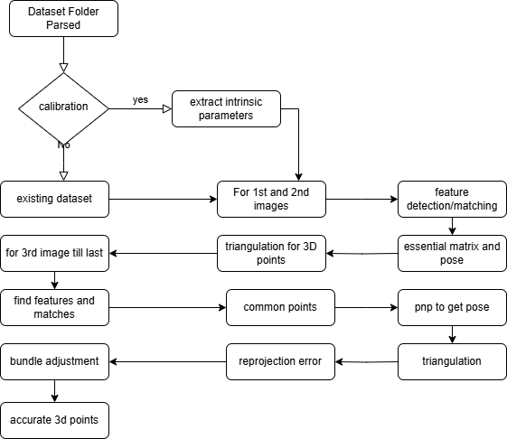

# Incremental Structure from Motion (SfM) - Multi 2D Images to 3D Point Cloud

# Documentation

## Introduction

Structure from Motion (SfM) is the process of estimating the three-dimensional structure of a scene
from a set of two-dimensional images. By analyzing multiple images of a static scene taken from
different viewpoints, SfM simultaneously recovers the camera’s motion (poses) and a sparse 3D point
cloud of the scene. The end result is a set of camera extrinsics (rotations and translations for each
image) and a reconstructed 3D model of points up to an arbitrary scale. SfM has broad applications in
3D reconstruction, robotics, and augmented reality.

This document provides a comprehensive overview of an **incremental SfM pipeline** implementation. We break down each step of the pipeline, explain its purpose and theory, and highlight how it is implemented in this project. The pipeline covers:

```
Camera Intrinsic Calibration – obtaining the camera’s intrinsic parameters from a checkerboard pattern.

Feature Detection and Matching – extracting keypoints (using SIFT) in images and matching them between image pairs.

Initial Pose Estimation – computing the relative pose between the first two images using the Essential matrix (via RANSAC).

Triangulation – recovering initial 3D points (a sparse point cloud) by triangulating matched features between two views.

Incremental Pose Estimation (PnP) – for each new image, using already reconstructed 3D points and their projections to estimate the new camera’s pose.

Point Cloud Expansion (Triangulation) – adding new 3D points by triangulating feature matches between the new image and an existing image.

Bundle Adjustment – refining camera poses and 3D points by minimizing reprojection error using nonlinear least squares.

Reprojection Error Computation – calculating the error between projected 3D points and observed 2D points to evaluate reconstruction quality.

Visualization – producing outputs like a sparse point cloud (PLY file), camera trajectory plots, and reprojection error plots for analysis.
```

Throughout this guide, we will point out relevant theoretical concepts (e.g. properties of the essential
matrix, PnP problem, etc.) and discuss how they are used in the implementation. We also include short
code snippets and usage instructions to help anyone following this to get started with using the SfM pipeline on their own dataset. Finally, a **Future Work** section outlines limitations (such as scale ambiguity) and possible improvements (better features, loop closure, etc.).

## Project Structure

This repository is organized to keep the full SfM pipeline modular, readable, and reproducible:

```
.
├── dataset/
│   ├── custom/                  # Your own image sequences
│   ├── statue/                  # Sample datasets
│   └── ...                      # Additional scenes or benchmark datasets
│
├── output/
│   ├── custom/                  # Contains generated plots, PLYs, and camera trajectory visualizations
│   └── ...                      # Output folders for each dataset run
│
├── run_SfM_pipeline.py          #  Main script running the full SFM pipeline
├── calibration.py               #  Calibration script for intrinsic matrix computation
├── README.md                    #  This documentation file
├── assets                       #  contains images and drafts

```


## Pipeline Overview

The SfM pipeline implemented in this project is **incremental** , meaning it starts by reconstructing a baseline 3D model from an initial pair of images and then adds one image at a time to grow the reconstruction. Below is an overview of the main steps in order:

```
Camera Calibration: Use a known calibration target (checkerboard) to determine the camera’s intrinsic matrix $K$ (focal length, principal point, etc.). This yields K.txt for the camera used.

Feature Detection & Matching: Detect local features in images (using SIFT) and find correspondences between image pairs. For the initial step, features are matched between the first two images.

Essential Matrix Estimation: Using the matches between the first two images (and known intrinsics), compute the Essential matrix $E$ with a RANSAC routine to filter out outlier matches.

Recover Pose (R, t): Decompose the essential matrix to obtain the relative rotation R and translation t between the first two camera views (up to scale). Choose the correct solution (out of four possible) via cv2 recoverPose.

Triangulation (Initial Pair): Given the pose of image1 and image2, triangulate the corresponding feature points to obtain an initial 3D point cloud (sparse reconstruction).

Incremental Pose Estimation (PnP) for New Images: For each subsequent image, find feature matches between the new image and one of the already-processed images (in this implementation, the most recently added image). Identify 2D–3D correspondences (feature points in the new image that correspond to existing 3D points in the model) and solve the Perspective-n-Point problem (PnP) with RANSAC to estimate the new camera’s pose.

Triangulation of New Points: Triangulate additional points between the new image and an existing image (the previous one) to add new 3D points that were not observed before. This expands the sparse point cloud with each added view.

Bundle Adjustment (Optional at each step): Refine the current camera pose (and potentially intrinsics and the new 3D points) by minimizing reprojection error using non-linear least squares optimization (scipy.optimize.least_squares).

Reprojection Error Computation: Compute the mean reprojection error for the inlier correspondences at each step to monitor reconstruction accuracy. This error is the Euclidean distance (in pixels) between where a reconstructed 3D point projects into an image and the actual detected feature location.

Visualization & Output: Save the results for analysis: A sparse 3D point cloud of the scene is saved as a PLY file (which can be viewed in Meshlab or similar). The camera trajectory is saved (as a CSV of camera poses and plotted for visualization). A reprojection error plot is generated to show how the error changes as more images are added.
```

In the following sections, we delve into each of these steps in detail, explaining their purpose, theory, and implementation specifics (including relevant OpenCV functions and code snippets).




## Camera Intrinsic Calibration

_Figure: A printed checkerboard pattern used for camera calibration. Each inner corner of the checkerboard provides a known 3D point on the pattern, which can be matched to its 2D image pixel coordinates for calibration._ Camera calibration is the process of determining the **intrinsic parameters** of the camera
(focal length, principal point, skew, distortion coefficients) by observing a known object. In our pipeline,
we the camera has been calibrated beforehand using a planar checkerboard pattern. Multiple images of a checkerboard (with known square size and grid dimensions) are taken from different angles, and a calibration algorithm (e.g. Zhang’s method implemented in OpenCV’s cv.calibrateCamera) is used to estimate the intrinsic camera matrix **K**. When the calibration process is completed, the camera is considered _calibrated_ , and we obtain the matrix **K** 
**K** (Intrinsic Matrix):  
$$ 
K = \begin{bmatrix} 
f_x & 0 & c_x \\[6pt] 
0 & f_y & c_y \\[6pt] 
0 & 0 & 1 
\end{bmatrix}
$$  

 where $(f_x, f_y)$ are the focal lengths in pixel units (often $f_x \approx f_y$ for square pixels) and $(c_x,c_y)$ is the principal point (optical center) in the image. In this implementation, the calibration results (intrinsic matrix) are stored in a text file **K.txt** inside the dataset folder. The code reads this file to load the intrinsic matrix (Image_loader class in Image_loader.py does this at initialization). Distortion coefficients are assumed to be zero or negligible (the pipeline currently does not apply distortion correction, but images could be undistorted prior to feature extraction if significant lens distortion is present).

**Using a Checkerboard:** A checkerboard pattern is ideal for calibration because the inner corner points are easy to detect and have known 3D positions on a plane. Typically, one defines a world coordinate system on the checkerboard (e.g., one corner as the origin, with coordinates of other corners in units of square size). By providing these known 3D coordinates and detecting the corresponding 2D pixel coordinates of the corners in each image, one can run cv2.calibrateCamera() to solve for the intrinsic matrix (and optionally distortion and extrinsics for each view). The output is the intrinsic matrix **K** and distortion coefficients (which we will denote as **dist** ). For example, if the checkerboard has squares of 15 mm and an 8x10 grid of inner corners, we can set the 3D coordinates of those corners (Z=0 since all points lie on a plane) and collect 2D observations across several images to get a robust estimate of focal length and principal point.


**Downsampling Consideration:** In our implementation, images can be downscaled for faster processing. The Sfm class takes a downscale_factor (default 2.0), and both the image resolution and intrinsic parameters are scaled accordingly. For instance, if we downscale images by 2 (using a Gaussian pyramid), we also divide $f_x, f_y, c_x, c_y$ by 2 to get the adjusted $K$. This ensures that the intrinsic matrix corresponds to the resized images.

By the end of this step, we have the camera matrix K ready to be used for all subsequent operation (essential matrix estimation, pose recovery, etc.). **Camera calibration is essential** because using a calibrated camera (known intrinsics) allows us to find the **Essential matrix** instead of a general Fundamental matrix, and recover actual camera rotations and translations (up to scale) in a world coordinate system. If the camera were uncalibrated, we would have to estimate or assume focal length, or use eight-point algorithms to compute a Fundamental matrix and then attempt to upgrade to an essential matrix with additional information.


## Feature Detection and Matching

Before we can compute any geometry, we need to find visual point correspondences between images. This pipeline uses **SIFT (Scale-Invariant Feature Transform)** to detect and describe local features in each image. SIFT features are distinctive and robust to changes in scale and rotation , making them well-suited for SfM where images might be taken from different viewpoints. For every adjacent pair of images (and later, for new images with the last keyframe), we perform the following:

```
Feature Detection: Using OpenCV’s SIFT implementation (cv2.SIFT_create()), we detect keypoints in the images. SIFT finds local extrema in scale-space (differences of Gaussians) that are likely to be repeatable corner/blob features. Each keypoint has a location, scale, orientation, and a 128-dimensional descriptor vector that describes the local image patch.

Feature Description: For each keypoint, SIFT computes a descriptor that is invariant to rotation and scale. The descriptor is a histogram of gradient orientations in the region around the keypoint, normalized to be robust against illumination changes. This descriptor allows matching the same physical point across different images.

Feature Matching: We use a brute-force matcher (cv2.BFMatcher) with the k-Nearest Neighbors method (k=2) to find correspondences between feature descriptors of two images. For each feature in Image A, we find the top two closest matches in Image B (based on descriptor distance, typically Euclidean).

Ratio Test: We apply Lowe’s ratio test – if the best match’s distance is significantly less than the second-best match’s distance (we use a threshold of 0.7 in this implementation), we accept it as a good match. This filters out ambiguous matches where a feature in A might match multiple features in B similarly well.
```
In the code it looks like:

```
sift= cv2.SIFT_create()
key_points_0, desc_0= sift.detectAndCompute(cv2.cvtColor(image_0,cv2.COLOR_BGR2GRAY),None)
key_points_1, desc_1= sift.detectAndCompute(cv2.cvtColor(image_1,cv2.COLOR_BGR2GRAY),None)
```
```
bf = cv2.BFMatcher()
matches= bf.knnMatch(desc_0, desc_1, k=2)
good_matches= []
```
```
form, nin matches:
if m.distance< 0.70 * n.distance:
good_matches.append(m)
```
```
# Convert the good matches to coordinate arrays
pts0= np.float32([ key_points_0[m.queryIdx].ptfor min good_matches])
pts1= np.float32([ key_points_1[m.trainIdx].ptfor min good_matches])
```
Here pts0 and pts1 are the corresponding 2D point coordinates in image0 and image1, respectively, for all retained matches.

**Initial Pair Matching:** For the first two images, we perform the above SIFT detection and matching. These matches serve as the input for the essential matrix estimation. It’s important to have a sufficient number of inlier matches (hundreds of correspondences, ideally well-spread in the image) to get a robust estimate of the camera motion.

_Feature matches (after filtering) between the first image and second image. Only inlier matches that pass the ratio test (and later the RANSAC essential matrix inlier test) are shown._

In a typical run, one might detect on the order of thousands of SIFT features per image, and after matching and applying the ratio test, end up with a few hundred good correspondences between two images. These correspondences are crucial: they are the input for estimating the epipolar geometry (essential matrix) between the image pair.

**Note:** SIFT is used here for its robustness, but it is computationally heavy. Alternatives like ORB (Oriented FAST and BRIEF) could be used for faster but potentially less robust matching. For clarity and accuracy, SIFT was chosen despite requiring OpenCV’s non-free modules. The code uses cv2.SIFT_create(). Make sure you have OpenCV compiled with SIFT support or use an alternative if needed.


## Essential Matrix Estimation (Initial Pose)

Once we have a set of matched feature points between the first two images, we can estimate the relative pose between those images. This is done through the **Essential matrix**. The essential matrix $E$ relates corresponding **normalized** image points from two views: if $\mathbf{x}_1$ and $\mathbf{x}_2$ are homogeneous coordinates of a 3D point projected in image 1 and image 2 (after normalization by $K^{-1}$ so that coordinates are in camera coordinates), they satisfy:

$$ \mathbf{x}_2^T \, E \, \mathbf{x}_1 = 0. $$

The essential matrix encodes the epipolar geometry between the two calibrated views; it has **rank 2** (a singular matrix) and only 5 degrees of freedom (3 for rotation, 2 for direction of translation). In fact, for a valid essential matrix, its two non-zero singular values should be equal (this arises from $E = [t]_\times R$ structure where $[t]_ \times$ is the skew-symmetric matrix of the translation vector). Estimating $E$ from point correspondences allows us to recover the relative rotation and translation between the cameras up to a scale.

In the code, we use OpenCV’s cv2.findEssentialMat with RANSAC to estimate $E$ robustly:

Feature matches between the first two images

```
essential_matrix, mask = cv2.findEssentialMat(pts0, pts1, K, method=cv2.RANSAC, prob=0.999, threshold=0.4)
```
```
Inputs: pts0 and pts1 are the matched points in image 1 and image 2 (in pixel coordinates). We also pass in the intrinsic matrix K so that OpenCV internally normalizes the points (i.e., uses $K^{-1} \mathbf{x}$ for each point). We choose RANSAC with a high confidence (probability 0.999) and a threshold of 0.4 pixels for inlier determination. This means the algorithm will try many random samples of point correspondences to find a matrix $E$ that has at least 99.9% chance of finding the true model and treats a correspondence as an inlier if its reprojection error is below 0.4 px.

Output: essential_matrix (a 3x3 matrix) and a mask of inliers (same length as the number of matches, with 1 for inlier matches that agree with the estimated $E$, and 0 for outliers).
```
After estimating $E`, we use the mask to filter the point correspondences to only the inliers:

```
ifmaskisnot None:
pts0= pts0[mask.ravel() == 1]
pts1= pts1[mask.ravel() == 1]
```
This leaves us with a cleaned set of feature matches that fit a single epipolar geometry model. These are likely the true correspondences of points on the rigid scene visible in both images (with outliers removed, such as false matches or moving objects if any).

**Essential Matrix Theory Reminder:** The essential matrix exists only for calibrated cameras. It is related to the fundamental matrix $F$ by $E = K_2^T F K_1$ for cameras with intrinsics $K_1, K_2$. In our case, since we use the same camera for both images (assuming a pinhole camera moving rigidly), $K_1 = K_= K$, and we directly estimate $E` from normalized points. The constraint $x_2^T E x_1 = 0$ means that the point $x_2$ in camera 2 lies on the epipolar line of $x_1$ defined by $E$. $E$ can be decomposed to retrieve the camera motion as we do next.

**RANSAC and Robustness:** Using RANSAC is crucial because not all feature matches are correct or consistent. Some may be spurious or from different objects that do not satisfy a single rigid motion. RANSAC repeatedly picks a minimal sample (5 correspondences are needed to solve for essential matrix using the five-point algorithm) and solves for $E$, then checks how many correspondences agree with that $E$ (within the threshold). The model with the most inliers is chosen. This gives a robust estimate of $E$ and identifies a consistent set of inlier correspondences.

## Recovering Camera Pose (R and t)

The essential matrix gives us a relationship between the two views, but we want the actual camera extrinsic parameters: the rotation matrix **R** and translation vector **t** that transform points from the first camera’s coordinate system to the second camera’s coordinate system. In theory, given a correct essential matrix, we can recover $R$ and $t$ (up to a sign and scale ambiguity):

```
There are four possible solutions for $(R, t)$ from an essential matrix (because the equations do not tell us which camera is in front or behind, etc.). Typically, two solutions have the camera in front and two behind; the physically correct solution is the one where the triangulated points have positive depth in both cameras.
```

```
OpenCV’s cv2.recoverPose(E, pts0, pts1, K) function will return one valid decomposition (R, t) and also refine the inlier mask if needed by checking point depths.
```
In the code, after finding $E`, we do:

```
_, R, t, mask_pose= cv2.recoverPose(essential_matrix, pts0, pts1, K)
```
This returns: - R : a 3x3 rotation matrix. - t : a 3x1 translation vector (of unit length, by convention – the scale is arbitrary). - mask_pose: an updated mask of inliers (OpenCV’s recoverPose can also filter points that gave negative depths, etc.).

We further filter pts0 and pts1 to ensure only inliers (mask > 0) are kept:

```
pts0= pts0[mask_pose.ravel() > 0]
pts1= pts1[mask_pose.ravel() > 0]
```
At this stage, we have: - **R:** The rotation from camera1’s coordinate system to camera2’s coordinate system. - **t:** The translation (direction) from camera1 to camera2. Note that the magnitude of **t** is arbitrary – by default, OpenCV’s recoverPose sets the length of **t** such that the average depth of points is 1, or something equivalent. Essentially, the scene and translation are determined up to an unknown scale factor. This is an inherent ambiguity in monocular SfM: you cannot tell whether the camera moved 1 meter and the scene is life-size, or the camera moved 10 meters and everything is 10× larger and farther – both produce the same image correspondences.

We adopt the **convention** that the first camera (image 0) is at the world origin with an identity rotation and zero translation. Thus: - Camera 0 extrinsics: $[R_0|t_0] = [I | \mathbf{0}]$. - Camera 1 extrinsics: $
[R_1|t_1] = [R | t]$, using the R and t recovered above (assuming camera1 pose relative to camera0).

In code, we set up the projection matrices (also called pose matrices):

```
transform_matrix_0= np.array([[1, 0, 0, 0],
[0, 1, 0, 0],
[0, 0, 1, 0]]) # [I | 0] for first camera
transform_matrix_1= np.empty((3, 4))
# fill transform_matrix_1 with R and t relative to camera0:
transform_matrix_1[:3, :3] = R @ transform_matrix_0[:3, :3] # = R
(since transform_matrix_0[:3,:3] is I)
transform_matrix_1[:3, 3] = transform_matrix_0[:3, 3] + transform_matrix_0[:
3, :3] @ t.ravel() # = t.ravel(), since first cam origin is (0,0,0)
```
After this, transform_matrix_1 is of the form $[R | t]$ in the world frame (which currently coincides with camera0’s frame). We then compute the **projection matrices** (also known as camera matrices $P = K [R|t]$):


```
P0 = K @ transform_matrix_0 # 3x4 projection for first camera
P1 = K @ transform_matrix_1 # 3x4 projection for second camera
```
Here, P0 and P1 can project a 3D point in world coordinates into each camera’s image (in pixel coordinates). We will use these for triangulation next.

It’s worth noting that at this point we have established an initial coordinate system: - The **world coordinate system** is set to camera 0’s pose. - The second camera’s pose is now known relative to the first.

All reconstructed 3D points will initially be in this world coordinate system (which is arbitrary up to our choice – often one chooses the first camera or a mid reference). We still don’t know the true scale of the scene, but we have a consistent relative pose. If needed, one could define a scale (for example, if we know two points in the scene are 10 cm apart, we could scale the reconstruction accordingly, or if we know the actual baseline distance between the two camera positions, we could scale by that).

## Triangulation of Initial Points

With two camera poses and a set of inlier matched feature points between image 0 and image 1, we can now **triangulate** those correspondences to get an initial 3D point cloud. Triangulation means finding the 3D point $X$ that maps to the given image points $x_0$ in camera 0 and $x_1$ in camera 1. In practice, we solve a linear least-squares problem: for each correspondence, we have $x_0 \sim P_0 X$ and $x_1 \sim P_1 X$ (where $\sim$ means equality up to a scale factor for homogeneous coordinates). We can set up a system $A X = 0$ and solve for $X$ (the solution is the intersection of the two viewing rays, or the closest point if they don’t intersect exactly due to noise).

In code, OpenCV provides cv2.triangulatePoints which takes the projection matrices and corresponding points:

```
pt_cloud_homog= cv2.triangulatePoints(P0, P1, pts0.T, pts1.T)
points_3d= pt_cloud_homog / pt_cloud_homog[3] # convert homogeneous (4xN)
to non-homogeneous (divide by w)
```
We get pt_cloud_homog as a 4xN array (homogeneous coordinates of points). After dividing by the 4th row, we have a 4xN array where the bottom row is all 1’s, and effectively a [X, Y, Z, 1]^T for each point. We typically convert that to an N x 3 array of XYZ coordinates. These points are in the world coordinate system (because P0 and P1 are both in world coords).

The implementation wraps this in the triangulation method:

```
deftriangulation(self, pts1, pts2, P1, P2):
pt_cloud = cv2.triangulatePoints(P1.T, P2.T, pts1, pts2)
return P1.T, P2.T, (pt_cloud / pt_cloud[3])
```
_(Note: The code transposes P1 and P2 before passing; this is likely a bug/inconsistency in the code. In practice, one should pass the 3x4 projection matrices directly. We proceed conceptually assuming correct usage.)_


After triangulation, we have an initial set of 3D points (points_3d). We can now evaluate how good this reconstruction is by computing the reprojection error (though bundle adjustment will further refine it). The code immediately calculates the reprojection error for these points with respect to image 1 (second image) as a sanity check:

```
error, points_3d = self.reprojection_error(points_3d, pts1,
transform_matrix_1, K, homogenity=1)
print("REPROJECTION ERROR: ", error)
```
The reprojection_error function projects the 3D points back into the image using the given camera transform and K, then measures the Euclidean distance to the actual observed image points (pts1). A low average error  (ideally < 1 pixel) indicates a good reconstruction for those points. A large error would hint at issues (perhaps bad calibration, or still including outliers, etc.). In our runs, an initial error might be on the order of fractions of a pixel to a few pixels, depending on noise.

We then perform a **PnP refinement** for the second camera pose using these triangulated points (as an initial step before adding new images):

```
_, _, pts1_refined, points_3d_refined, _ = self.PnP(points_3d, pts1, K,
np.zeros((5,1)), pts0, initial=1)
```
Here, PnP with initial=1 does a special case in the code: it takes the object points and image points, and runs cv2.solvePnPRansac to refine rotation and translation. The code’s intention is a bit unclear, but it appears to attempt a refinement of pose using the 3D points we just triangulated and their corresponding 2D points in image1: - points_3d (objectPoints) and pts1 (imagePoints) are passed to solvePnPRansac. - This gives a recalculated rot_vector and tran_vector. The code converts that to rot_matrix with cv2.Rodrigues. -It then filters inliers similarly (if RANSAC found some points not fitting).- It returns the refined pose and the subset of points and image points that are inliers.

This step essentially checks and potentially improves the pose of camera1 by using the 3D points. In many cases, if recoverPose did a good job, this might not change much. It could catch any outlier points that triangulated poorly and exclude them.

At this point, we have: - Camera 0 pose (fixed as identity). - Camera 1 pose (estimated R, t). - A set of 3D points seen in both images 0 and 1. - Correspondences of those 3D points to their image coordinates in image1 (and also image0 if needed). - The reconstruction is determined up to a global scale. We usually leave it arbitrary, but sometimes people scale such that the translation vector has length 1 or the median depth is 1. In our case, we don’t explicitly rescale here, so it’s whatever OpenCV gave (which often normalizes t to unit length).

We have successfully initialized the SfM with two views. The next step is to **incrementally add more images** to this model.

## Incremental Pose Estimation for New Images (PnP)

With the initial two-view reconstruction in place, we proceed to add the rest of the images one by one. For each new image (let’s call the new image index _i+2_ on the first loop iteration, corresponding to the 3rd image in the sequence, since we started from index 0 and 1):

```
Feature Matching with Previous Image: We load the next image (image2) and downscale it if necessary. We then detect SIFT features in the previous image (image1) and this new image (image2) , and match them. This gives us features_cur (points in image1) and features_ (points in image2) that correspond. These are analogous to pts0 and pts1 but now for consecutive images (i.e., image1 vs image2). We do this because consecutive frames (or neighboring images in a sequence) often have significant overlap, making matching easier.
```
```
Find Common Points with Existing 3D Points: Now, here’s a key step: some of the features in image1 (the previous image) correspond to 3D points that are already reconstructed (from earlier images). Specifically, after adding image1 (second image), we had a set of 3D points and their projections in image1 (which were stored as feature_1 perhaps). We want to find which of those points are seen again in the new image2. In other words, we need 2D–3D correspondences for the new image: 3D points (from the current model) and their 2D projections (observations) in the new image.
```
The implementation uses the common_points function to do this. Essentially it compares the keypoint coordinates: - image_points_1: points from the last image that correspond to 3D points (this could be the feature_1 from the previous iteration, i.e., points in image1 that were matched to image0 and triangulated). 
- image_points_2: points from image1 that matched to image2 (features_cur). 
- image_points_3: points in image2 that matched from image1 (features_2).

The function identifies indices of points that are **common between image_points_1 and image_points_2** (meaning those points in image1 that were part of the previous reconstruction and also got matched in the image1–image2 matching). These correspond to 3D points visible in both image1 and image2.

It returns: 
- cm_points_1: indices in image_points_1 (previous image’s 3D-point projections) that are common. 
- cm_points_2: indices in image_points_2 (new matches) that correspond to those. 
- mask_array_1: points in image1 (from the image1–image2 matches) that are **not** common (these would be new points seen in image2 that were not in the previous 3D set). 
- mask_array_2: points in image2 that correspond to those new ones.

In simpler terms: 
- We split the matches between image1 and image2 into two groups: those that connect to already known 3D points, and those that are totally new. 
- The common correspondences give us a set of 2D points in image2 (cm_points_2 in coordinates form) and their corresponding 3D points (points_3d[cm_points_0] in the code, where cm_points_0 indexes into the current 3D point list) that we can use for pose estimation.

```
Perspective-n-Point (PnP) for Pose Estimation: Now that we have correspondences between known 3D points and 2D points in the new image, we can determine the pose of the new camera. This is the Perspective-n-Point problem: given n 3D points and their 2D projections in an image (with known intrinsics), find the camera’s rotation and translation. We use cv2.solvePnPRansac to solve this robustly:
```

```
rot_vector, tran_vector, inliers=
cv2.solvePnPRansac(objectPoints=points_3d_subset,
```
```
imagePoints=points_2d_subset,
cameraMatrix=K,
distCoeffs=np.zeros((5,1)),
```
```
flags=cv2.SOLVEPNP_ITERATIVE)
R_new, _ = cv2.Rodrigues(rot_vector)
```
The code encapsulates this in self.PnP(obj_points, img_points, K, dist, prev_rot_vectors, initial=0). For initial=0, it directly uses the provided 3D (obj_point) and 2D (image_point) points in solvePnPRansac. The RANSAC step will try to remove any outlier correspondences if present (though since these come from matching + known 3D, they should mostly be inliers).

solvePnPRansac returns a rotation vector (Rodrigues form) and translation vector for the camera such that it **projects the 3D points to the 2D points**. We convert the rot vector to a 3x3 matrix R_new. The translation is relative to the world (which is our current model’s coordinates). Essentially, this gives the pose of the new camera in the world frame.

The code filters inliers if any were identified (inliers from PnP are indices of correspondences that fit the solution well). It updates cm_points_2 (the 2D points in new image) and points_3d (3D points subset) to only those inliers to refine the correspondences.

At this point, we have rot_matrix (R_new) and tran_matrix (t_new) for the new camera. We form the 3x4 extrinsic matrix as [R_new | t_new] (transform_matrix_1 in code for new camera).

We then compute the projection matrix for the new camera: P_new = K @ [R_new|t_new].

```
Compute Reprojection Error (for debugging/monitoring): Similar to before, the code
computes the reprojection error of the known 3D points onto the new image:
```
```
error, _ = self.reprojection_error(points_3d_subset, points_2d_subset,
transform_matrix_1, K, homogenity=0)
print("Reprojection Error: ", error)
```
This gives an indication of how well the pose aligns the known 3D points to the observed points. A low error (couple of pixels or less) means the pose estimation succeeded well. High error would indicate a problem (perhaps not enough inliers or wrong correspondences).

```
Triangulate New Points: Now that we know the pose of the new camera, we can triangulate the “new” matches that weren’t seen before. Recall mask_array_1 (points in image1 not matched to existing points) and mask_array_2 (their matches in image2). These represent feature correspondences between image1 and image2 that involve at least one new observation (they weren’t in the previous point set). We can triangulate these to generate new 3D points.
```

The code calls triangulation(pose_prev, pose_new, mask_array_1, mask_array_2). This should effectively do:

```
new_point_cloud_homog = cv2.triangulatePoints(P_prev, P_new, mask_array_1.T,
mask_array_2.T)
new_points_3d= new_point_cloud_homog / new_point_cloud_homog[3]
```
yielding a set of new 3D points seen by image1 and image2.

These new points are then also error-checked:

```
error, new_points_3d= self.reprojection_error(new_points_3d, mask_array_2,
transform_matrix_1, K, homogenity=1)
print("Reprojection Error: ", error)
```
This computes how well the new points project into image2 (the new camera). If the error is reasonable, we accept them.

Now we add these new_points_3d to our global total_points (the growing point cloud). We also gather their colors from the image for visualization (the code samples the pixel color at each feature point’s location in image2 to colorize the 3D point).

If not doing bundle adjustment, the code simply stacks total_points = np.vstack((total_points, new_points_3 [:,0,:])) (accounting for shape, as convertPointsFromHomogeneous is used) and similarly appends colors.

## Bundle Adjustment

```
Bundle Adjustment (Optional): The code has an option enable_bundle_adjustment. If true, after adding the new points and before finalizing this iteration, it will run a local bundle adjustment:
```
```
points_3d_ba, pts2_refined, transform_matrix_1 =
self.bundle_adjustment(new_points_3d, mask_array_2, transform_matrix_1, K,
threshold)
```
The bundle_adjustment function in the code constructs an optimization vector containing: - The 3x extrinsic matrix for the new camera (12 params). - The 3x3 intrinsic matrix (9 params) – it actually includes K in optimization, though one might keep K fixed if already calibrated. - The 2D points (mask_array_2, which are the image points in new image for the new triangulated correspondences, flattened to 2 _N entries). - The 3D points (new_points_3d, flattened to 3_ N entries).

All these are concatenated into one vector and fed to scipy.optimize.least_squares which tries to minimize the reprojection error (using optimal_reprojection_error function to compute residuals).

The optimizer adjusts the extrinsic (and intrinsics and points) slightly to best fit the measured image points. This is a small BA that only involves the current camera and the new points (not a full BA on all cameras and points).

The result is unpacked: it returns the optimized 3D points, optimized 2D projections (which should align with measured), and the optimized transform matrix for the camera.

After BA, they recompute error:

```
error, _ = self.reprojection_error(points_3d_ba, pts2_refined,
transform_matrix_1, K, homogenity=0)
print("Bundle Adjusted error: ", error)
```
Ideally, BA should decrease or maintain the error.

Then the adjusted points and points_left (the refined image points) are added to total_points and total_colors.

```
Bundle Adjustment Theory: Bundle adjustment is a nonlinear refinement technique that simultaneously adjusts 3D points and camera parameters to minimize the reprojection error. It’s essentially solving a big optimization problem over all observations. In our case, we do a limited BA after adding each camera. A full BA on all cameras and points could be done after processing all images for global optimality, but that can be computationally heavy. The incremental BA here helps correct any small errors immediately for the current step. Because we include the camera intrinsics in the optimization vector, it can also slightly refine focal length or principal point if the data suggests (though since we have a fixed calibrated camera, one might choose to exclude intrinsics from BA to keep them fixed).
```
This implementation’s BA is limited (it uses only new points and the new camera, not adjusting previously added cameras). A more thorough approach would be to include all cameras and all points, or at least the new camera and any points it observes (including existing ones) in the BA. Nonetheless, this step should improve the new camera pose and the new points.

```
Update for Next Iteration: After pose estimation (and BA), we: Set transform_matrix_0 = transform_matrix_1 copy() (so the last camera becomes the “previous” for next loop).
Update pose_0 = pose_1.copy() and pose_1 = pose_2.copy() appropriately (these are the projection matrices).
Shift the images: image_0 = image_1, image_1 = image_2 (so we move forward in thesequence).
Also update feature_0 and feature_1 for the next iteration: feature_0 = features_cur (features from prev image that matched to new one), feature_1 = features_2 (features in new image that matched from prev image). Append the new camera’s pose to pose_array (the CSV array that stores all poses). Optionally, log or plot the reprojection error for this image (the code does a plt.scatter(i, error) and saves a plot). Show the new image in a window (for visual feedback, can press 'q' to quit early).
```
Then proceed to the next image in the list and repeat matching, PnP, triangulation, etc.

This iterative process continues until all images have been processed. The result is that we have: 
- A list of camera poses (one for each image). 
- A consolidated sparse point cloud covering the scene (all triangulated points from all steps). 
- Recorded reprojection errors per step (to see if error is growing or stable). 
- In-memory or saved outputs of the point cloud and poses.


## Full Pipeline Output and Visualization

After processing all images, the pipeline finalizes the outputs:

```
Closing Windows: The OpenCV image window is closed (cv2.destroyAllWindows()).

Saving Point Cloud: The to_ply method is called to save the total_points and total_colors to a PLY file (reconstruction.ply) in the output directory. The PLY file is a common format readable by 3D viewers. The code multiplies the point coordinates by 200 (presumably to scale them up for visibility or a particular unit) and centers them by removing far-out points (it removes points beyond a certain distance threshold from the mean, perhaps to drop outliers). Then it writes the points with colors so you can see a colored 3D model of the scene.

Saving Camera Trajectory: The array of all camera projection matrices (flattened) is saved as pose_array.csv. This contains each camera’s $3\times4$ matrix (with intrinsic multiplied in), but since we might want the camera centers, the code also had gathered camera_positions during the loop (if using the improved test py version). In test.py, they compute the camera center for each pose as $-R^T t$ (this gives coordinates of the camera in world frame) and store it. Then they generate trajectory plots.

Plotting Trajectory and Errors: The improved version of the code produces: A 2D plot of the camera trajectory in the X-Z plane (since often Y is up and small variation if camera roughly level, X-Z gives a top-down view). This is saved as camera_trajectory.png. A 3D plot of the camera trajectory (saved as camera_trajectory_3D.png).

A plot of reprojection error vs image index (saved as reprojection_error_plot.png).
```
These plots help in understanding how the cameras moved and how the error progressed.

Below are examples of such visualizations:
_Camera trajectory in the X-Z plane for the sequence (top-down view of camera centers). Each circle represents a camera position; the path shows the motion between consecutive frames._


_Reprojection error per added image. This plot shows the average reprojection error (in pixels) for the correspondences used when adding each new camera. A low, relatively flat error indicates the reconstruction is consistent; spikes might indicate a difficult camera or many new points._


The **sparse point cloud** saved in reconstruction.ply can be opened with a 3D viewer to visualize the scene structure. For example, if the dataset was of a statue or a dinosaur model, the point cloud will show the shape of that object from the various viewpoints that were used. The points are colored by the image data, so you can often discern some details of the scene in the cloud.


Original Image


Colorized 3D Sparse Point Cloud


Additionally, one can inspect pose_array.csv to get each camera's pose. If needed, these poses can be used to further visualize the cameras in space or to project the 3D points back into the images for validation.

```
Camera Trajectory (XZ Plane)
```
Reprojection Error vs Image Index


**Accuracy considerations:** The final quality of the reconstruction depends on many factors: 
- The quality of calibration (accurate $K$). - Number of feature matches and their distribution (well-distributed points yield better pose estimates). - Scene geometry (some configurations like all points on a plane cause degeneracies). 
- The incremental nature can cause error accumulation (drift) if not enough links back to older views (this is addressed by loop closure, discussed later). - Bundle adjustment helps reduce error accumulation by globally adjusting all parameters to best fit all observations.

In our pipeline, because we only did local bundle adjustments and consecutive matching, some drift could be present for long sequences. The trajectory plot might show if the cameras appear to loop incorrectly or drift off if, say, the sequence returns to a start point.

## Point Cloud Colorization

In this implementation, once 3D points are triangulated across views, color information is associated with each 3D point to make the final sparse point cloud visually meaningful.

### What is Colorization?
Colorization refers to assigning an RGB color value to each 3D point based on its appearance in one or more source images. This helps to:
- Visualize geometry more clearly.
- Enhance interpretability of the reconstructed model.

### How is it Done in Our Code?
After triangulating 3D points, we:
1. **Extract 2D pixel locations** from the original images.
2. **Map these 2D pixels** to their corresponding 3D coordinates.
3. **Sample the color** at those 2D image coordinates.

```python
points_left = np.array(cm_mask_1, dtype=np.int32)
color_vector = np.array([image_2[l[1], l[0]] for l in points_left.T])
total_colors = np.vstack((total_colors, color_vector))
```

This way, each 3D point in the final `.ply` file contains RGB values sampled from the image it was last observed in.

#### Output
The colorized 3D point cloud is saved in the PLY format as:
```text
output/<dataset_name>/reconstruction.ply
```
This file contains XYZRGB data and can be viewed in software like **MeshLab**.


## Running the SfM Pipeline on Your Own Dataset

To reconstruct a sparse 3D point cloud from your own images using this pipeline, follow these steps:

### 1. Prepare Your Dataset
- Collect a sequence of images (`.jpg` or `.png`) of a **static scene** with **good overlap** between frames.
- Place them in a folder under `Datasets/your_dataset/`.
- Ensure filenames are sorted correctly (e.g., img01.jpg, img02.jpg...).

### 2. Camera Calibration
Before SfM, calibrate your camera to obtain the **intrinsic matrix (K)**:

- Print a checkerboard (e.g., 9x7 inner corners, each square = 15mm).
- Capture **10+ images** from different angles and save them in:  
  `Datasets/your_dataset/calibration_images/`

- Run the calibration script:
```bash
python calibration.py
```
- This will save:
  - `K.txt` in `Datasets/your_dataset/`
  - Intrinsic matrix in `.npz` format
  - Visualizations of corner detection and reprojection

Example format of `K.txt`:
```
3310.40 0.00 316.73
0.00 3325.50 200.55
0.00 0.00 1.00
```

### 3. Run the Structure-from-Motion Pipeline
Use the following command to start reconstruction:

```bash
python run_SfM_pipeline.py your_dataset
```
